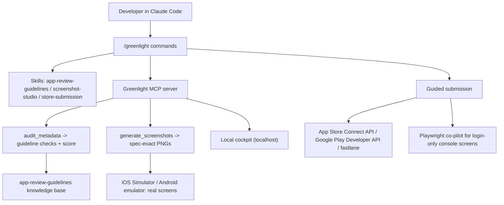

# Greenlight Architecture

Greenlight is a Claude Code plugin. One install gives a developer a set of
skills (knowledge), an MCP server (tools that do work), and slash commands
(entry points), plus a local cockpit for a visual review board.

## Components

- Commands (`commands/*.md`): `/greenlight:preflight`, `:audit`, `:screenshots`,
  `:submit`, `:privacy`, `:cockpit`. These are the entry points.
- Skills (`skills/*/SKILL.md`): the knowledge the agent loads on demand.
  - `app-review-guidelines`: rules, rejection reasons, submission flows, 2026
    changes, asset specs, privacy. The brain.
  - `screenshot-studio`: how to capture real screens and render spec-exact images.
  - `store-submission`: how to submit via API / fastlane / Playwright co-pilot.
- MCP server (`server/`): a Python FastMCP server exposing tools.
  - `audit_metadata`: maps project facts to guideline checks, returns a checklist
    and a pass-probability score.
  - `generate_screenshots`: renders spec-exact PNGs from real screens.
  - `list_specs`: the supported store asset sizes.
  - cockpit: a local Flask app (localhost) that visualizes audit, assets, and the
    submission tracker, hot-reloading like HyperFrames.
- Renders (`renders/`): output PNGs. Templates (`templates/`): HTML/CSS screenshot
  templates (production path).

## Flow



## Why a plugin (not just a skill)

A skill is knowledge only. Greenlight also has to do work (render images, run a
local server, call store APIs, drive Playwright). That needs an MCP server. A
plugin is the container that ships skills + MCP + commands together, so a user
installs once and gets everything:

```
/plugin marketplace add danlee-dev/greenlight
/plugin install greenlight@greenlight
```

## The no-paste principle

The pain Greenlight removes is the "click next, screenshot, paste, wait" loop.
The architecture forbids that loop: it reaches the live console state through the
official APIs first, and through a user-run Playwright script second. The user
never pastes console screenshots manually.
